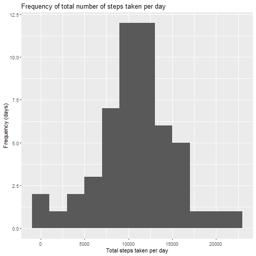
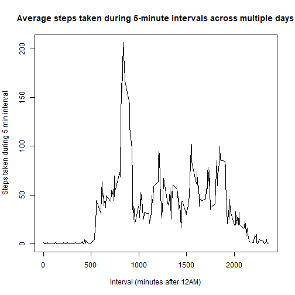
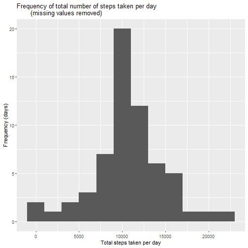
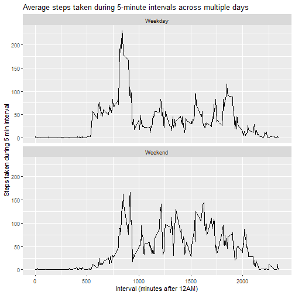

## Loading and preprocessing the data
1. Unzip folder and read enclosed .csv file into a data frame
2. Convert data frame to a tibble

```r
files <- unzip("activity.zip", list = T)
data <- read.csv(unz("activity.zip", files$Name[1]))
library(tidyverse)
data <- as_tibble(data)
```

## What is mean total number of steps taken per day?
Remove missing values and calculate step totals for each day

```r
data$date <- as.Date(data$date, "%Y-%m-%d")
step_totals <- data %>% 
        drop_na() %>% 
        group_by(date) %>% 
        summarize(steps = sum(steps))
```
Make a histogram of number of steps per day

```r
p <- qplot(step_totals$steps)
p + stat_bin(binwidth = 2000) + 
  labs(title = "Frequency of total number of steps taken per day",
           x = "Total steps taken per day", y = "Frequency (days)")
```

```
## `stat_bin()` using `bins = 30`. Pick better value with `binwidth`.
```



Calculate and report the mean and median of total steps per day

```r
daily_step_summary <- step_totals %>% 
  summarize(mean = mean(steps), median = median(steps))
library(xtable)
xt <- xtable(x = daily_step_summary, caption = "Average steps per day")
print(xt, "html")
```

<!-- html table generated in R 4.0.5 by xtable 1.8-4 package -->
<!-- Thu Jun 24 09:34:48 2021 -->
<table border=1>
<caption align="bottom"> Average steps per day </caption>
<tr> <th>  </th> <th> mean </th> <th> median </th>  </tr>
  <tr> <td align="right"> 1 </td> <td align="right"> 10766.19 </td> <td align="right"> 10765 </td> </tr>
   </table>

## What is the average daily activity pattern?
- Get average steps for each interval across all days
- Plot as a time-series plot
- Calculate and report interval with max average steps across all days

```r
interval_avg <- data %>%
  drop_na() %>% 
  group_by(interval) %>% 
  summarize(avg = mean(steps))


plot(x = interval_avg$interval, y = interval_avg$avg, type = "l", 
     xlab = "Interval (minutes after 12AM)", 
     ylab = "Steps taken during 5 min interval",
     main = "Average steps taken during 5-minute intervals across multiple days")
```



```r
interval_avg %>% 
  arrange(desc(avg)) %>% 
  slice(1)
```

```
## # A tibble: 1 x 2
##   interval   avg
##      <int> <dbl>
## 1      835  206.
```

## Imputing missing values
Calculate number of missing values

```r
data %>% summarize(missing.values = sum(is.na(.)))
```

```
## # A tibble: 1 x 1
##   missing.values
##            <int>
## 1           2304
```

- Fill in missing values with mean for that interval across all days

```r
data_full <- left_join(data, interval_avg)
```

```
## Joining, by = "interval"
```

```r
data_full <- data_full %>% 
  mutate(steps = coalesce(steps, avg))
```

- Make a histogram of total steps per day

```r
imputed_step_totals <- data_full %>% 
        group_by(date) %>% 
        summarize(steps = sum(steps))

p <- qplot(imputed_step_totals$steps)
p + stat_bin(binwidth = 2000) + 
  labs(title = "Frequency of total number of steps taken per day
       (missing values removed)",
           x = "Total steps taken per day", y = "Frequency (days)")
```

```
## `stat_bin()` using `bins = 30`. Pick better value with `binwidth`.
```



- Calculate and report mean and median total steps per day  

```r
imputed_daily_step_summary <- imputed_step_totals %>% 
  summarize(mean = mean(steps), median = median(steps))
library(xtable)
xt <- xtable(x = imputed_daily_step_summary, caption = "Average steps per day
             (missing values removed)")
print(xt, "html")
```

<!-- html table generated in R 4.0.5 by xtable 1.8-4 package -->
<!-- Thu Jun 24 09:34:49 2021 -->
<table border=1>
<caption align="bottom"> Average steps per day
             (missing values removed) </caption>
<tr> <th>  </th> <th> mean </th> <th> median </th>  </tr>
  <tr> <td align="right"> 1 </td> <td align="right"> 10766.19 </td> <td align="right"> 10766.19 </td> </tr>
   </table>
*This method of imputing missing data (using the average for that interval
across all days) did not impact the mean and median total number of steps
taken per day.*  

## Are there differences in activity patterns between weekdays and weekends?
Add weekday factor to imputed data set

```r
library(lubridate)
data_full <- data_full %>% 
  mutate(weekdays = wday(date, abbr = T)) %>% 
  mutate(weekdays = if_else(weekdays < 7 & weekdays > 1, "Weekday", "Weekend")) %>% 
  mutate(weekdays = as.factor(weekdays))
```
Make a panel plot comparing average number of steps during 5-minute intervals
throughout the day across weekdays versus weekends

```r
wd_interval_avg <- data_full %>%
  group_by(interval, weekdays) %>% 
  summarize(avg = mean(steps))
```

```
## `summarise()` has grouped output by 'interval'. You can override using the `.groups` argument.
```

```r
p <- ggplot(data = wd_interval_avg)
p + geom_line(mapping = aes(x = interval, y = avg)) + 
  facet_wrap(~ weekdays, nrow = 2) + labs(
  x= "Interval (minutes after 12AM)", 
  y = "Steps taken during 5 min interval",
  title = "Average steps taken during 5-minute intervals across multiple days"
)
```


